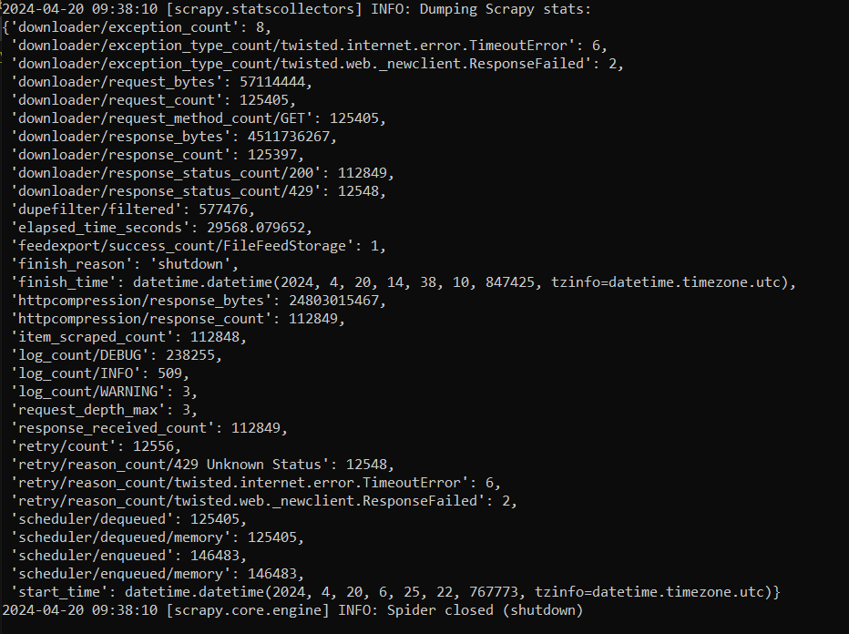

<h1>Wikipedia Information Retrieval Scraper and Query Processor</h1>

<h2>Abstract</h2>  

For this project I set out to use articles from Wikipedia to build an information retrieval system that could process user queries and link to relevant Wikipedia pages using tools and frameworks such as Scrapy for crawling wikipedia articles, Scikit-Learn for building an Indexer, and Flask for processing user queries and displaying articles.

<h2>Overview</h2>  

My goal was to create a simple indexer and query processor that could be iterated on for future use. Different machine learning techniques could be implemented in the future for better or faster recommendations. 

I split my code into 3 python files Crawler.py to crawl wikipedia and collect text and output a json file. indexer.py to take the json file and convert it to an inverted index of tf idf scores, and Processor.py to process queries using the inverted index and recommend articles. 

<h2>Design</h2>  

<h2>Architecture</h2>  

Processor system is built primarily using Python, leveraging various libraries and frameworks for processing, storing, and presenting data. The architecture comprises several software components, interconnected through well-defined interfaces. Flask renders HTML templates to present search results and facilitate user interactions. Crawler component provides crawled article documents to the Indexer. JSON and pickle formats are used for storing article text and inverted index of tfidf scores

<h2>Operation</h2>  
<h3>Crawler.py</h3>

The crawler can be run in the terminal using command <b>“scrapy runspider crawler.py -o output.json” </b>b>where output.json is the json output file. A max depth or max pages can be set in crawler.py under custom_settings. The seed can be set under start_urls

<h3>indexer.py</h3>

The indexer can be run in the terminal like a regular python file. <b>“Python indexer.py”</b>. Before running you should set the input json file under the input_file variable and the output pickle file under output_file

<h3>Processor.py</h3>

The Processor can be run using command <b>“flask –app processor run”</b>. The terminal will then give you an address you can put into your browser. Here you can put in queries into the text box and press search to search. When using overnightIndex.pkl query processing can take up to a minute depending on query length. To switch to a smaller index you can change the index_file variable to indexsmall.pkl. 

<h2>Conclusion</h2>  

I managed to index over 100,000 articles over the span of about 8 hours to the amount of 6.5 GB of text. The depth during this time did not go past 3 links deep. I choose to use a starting seed of wiki/sports. 

To save on space the crawler does not download HMTL data! Instead it downloads only the text. This data is not lost, however as a link to the online wikipedia article is preserved. This means a working internet connection is required when using this project.  

Here is an example of running the query “computing and information science”

Provided is a link to the wikipeida article along with the cosine similarity score between the article and the query. 

 
<h2>Data Sources</h2>  

For my data source I used wikipedia. On wikipeida users collaborate together to create articles on a large variety of topics. It was very easy to crawl and had easily accessible articles for scraping and indexing. Wikipedia has a wide range of articles covering many topics, making it an ideal choice for scraping and indexing. 

<h2>Testing</h2>  

I tested my code using known practice problems from the book and previous classes. I checked the tfidf scores matched and that query vectors would match when taking cosine similarity. I didn’t have a good way to test the crawler or the query output other than they work for a variety of inputs I tried and the crawler did not get stuck even after 8 hours.

<h2>Source Code</h2>  

Python 3.10.14

Scikit-learn 1.3.0

Scrapy 2.11.1

Flask 2.2.5

Werkzeug 2.2.3

Numpy 1.26.4

Joblib 1.2.0

